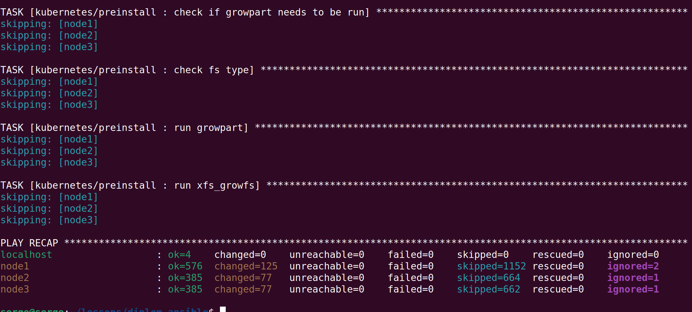
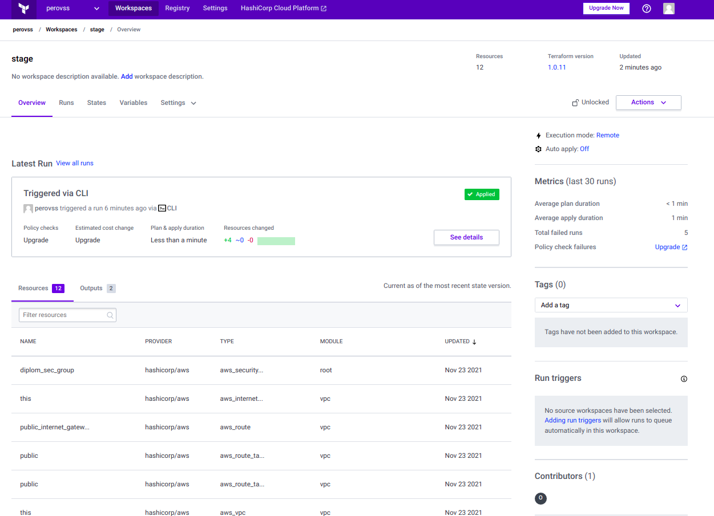
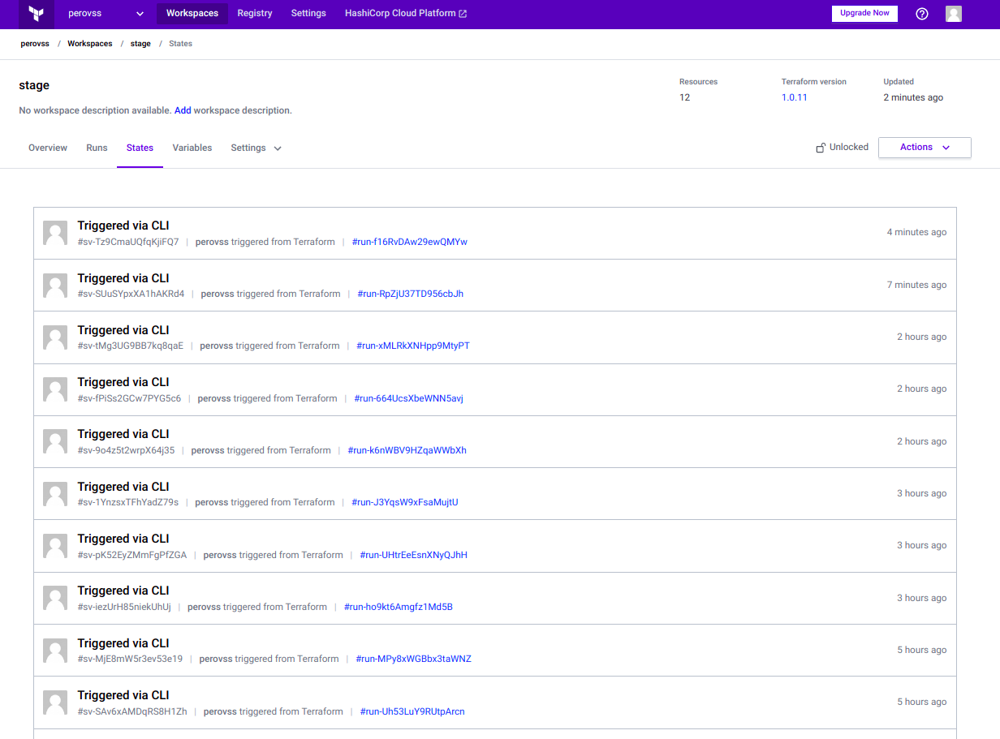
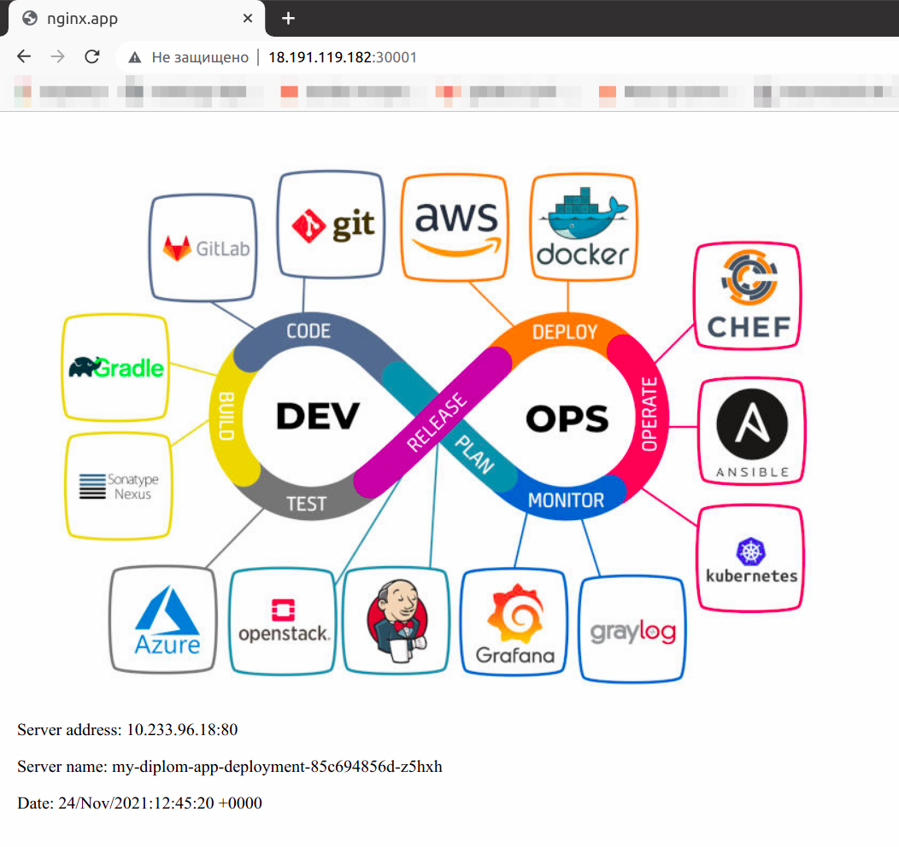
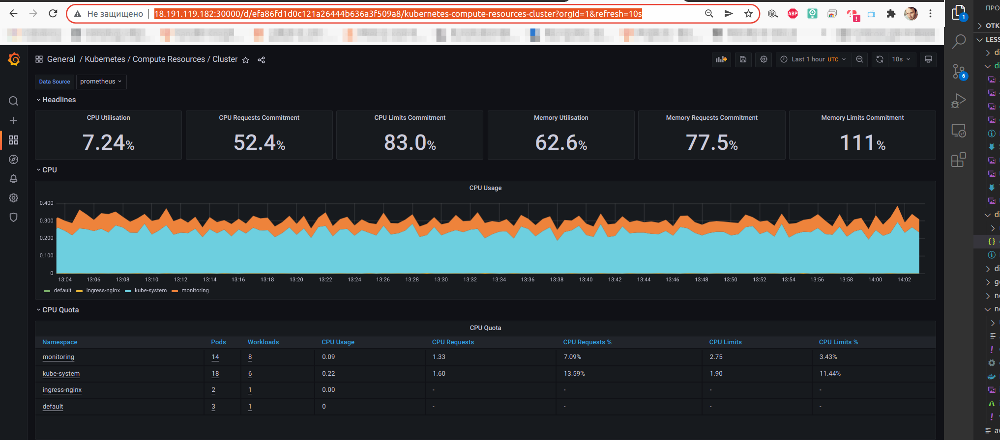

# Дипломная работа к профессии "DevOps-инженер"

Цели:
1. Подготовить облачную инфраструктуру на базе облачного провайдера AWS.
2. Запустить и сконфигурировать kubernetes-кластер.
3. Установить и настроить систему мониторинга.
4. Настроить и автоматизировать сборку тестового приложения с использованием Docker-контейнеров.
5. Настроить CI для автоматической сборки и тестирования.
6. Настроить CD для автоматического развёртывания приложения.

Этапы выполнения:

## Создание облачной инфраструктуры


Ожидаемые результаты:
1. Terraform сконфигурирован и создание инфраструктуры посредством terraform возможно без дополнительных ручных действий.
1. Полученная конфигурация инфраструктуры является предварительной, поэтому в ходе дальнейшего выполнения задания возможны изменения.

Установлена последняя стабильная версия [Terraform](https://www.terraform.io/).

```html
serge@notebook:~/lessons$ terraform --version
Terraform v1.0.11
on linux_amd64
```

[Cсылка на конфигурацию инфраструктуры](https://github.com/Perovss/diplom_terraform_cloud)


## Создание кубернетес кластера

Ожидаемый результат:

1. Работоспособный кубернетес кластер.

2. В файле `~/.kube/config` находятся данные для доступа к кластеру.

3. Команда `kubectl get pods --all-namespaces` отрабатывает без ошибок.

   ```
   root@node1:/home/ubuntu/diplom_k8s_config# kubectl get pods --all-namespaces
   NAMESPACE       NAME                                        READY   STATUS    RESTARTS      AGE
   default         my-diplom-app-deployment-85c694856d-8mst4   1/1     Running   0             45m
   default         my-diplom-app-deployment-85c694856d-pzfqt   1/1     Running   0             45m
   default         my-diplom-app-deployment-85c694856d-z5hxh   1/1     Running   0             45m
   ingress-nginx   ingress-nginx-controller-r2gpd              1/1     Running   0             70m
   ingress-nginx   ingress-nginx-controller-t7x6q              1/1     Running   0             70m
   kube-system     calico-kube-controllers-684bcfdc59-qxrcr    1/1     Running   2 (72m ago)   72m
   kube-system     calico-node-9pwvv                           1/1     Running   0             73m
   kube-system     calico-node-kbgr8                           1/1     Running   1 (73m ago)   73m
   kube-system     calico-node-wfkmt                           1/1     Running   2 (73m ago)   73m
   kube-system     coredns-8474476ff8-dhg9h                    1/1     Running   0             67m
   kube-system     coredns-8474476ff8-wmfdg                    1/1     Running   0             68m
   kube-system     dns-autoscaler-5ffdc7f89d-pgbzv             1/1     Running   0             67m
   kube-system     kube-apiserver-node1                        1/1     Running   0             79m
   kube-system     kube-controller-manager-node1               1/1     Running   1             79m
   kube-system     kube-proxy-jrjr9                            1/1     Running   0             75m
   kube-system     kube-proxy-qngfq                            1/1     Running   0             75m
   kube-system     kube-proxy-xqnkr                            1/1     Running   0             75m
   kube-system     kube-scheduler-node1                        1/1     Running   1             79m
   kube-system     nginx-proxy-node2                           1/1     Running   0             76m
   kube-system     nginx-proxy-node3                           1/1     Running   0             76m
   kube-system     nodelocaldns-mfzlm                          1/1     Running   0             67m
   kube-system     nodelocaldns-qjs84                          1/1     Running   0             67m
   kube-system     nodelocaldns-srf6l                          1/1     Running   0             67m
   monitoring      alertmanager-main-0                         2/2     Running   0             45m
   monitoring      alertmanager-main-1                         2/2     Running   0             45m
   monitoring      alertmanager-main-2                         2/2     Running   0             45m
   monitoring      blackbox-exporter-6798fb5bb4-6bhhd          3/3     Running   0             45m
   monitoring      grafana-7f4665cb5f-jqbl8                    1/1     Running   0             45m
   monitoring      kube-state-metrics-6c699dfb8-z8hgg          3/3     Running   0             45m
   monitoring      node-exporter-vbb27                         2/2     Running   0             45m
   monitoring      node-exporter-w6krw                         2/2     Running   0             45m
   monitoring      node-exporter-z58lw                         2/2     Running   0             45m
   monitoring      prometheus-adapter-7dc46dd46d-mq5dt         1/1     Running   0             45m
   monitoring      prometheus-adapter-7dc46dd46d-q2bq4         1/1     Running   0             45m
   monitoring      prometheus-k8s-0                            2/2     Running   0             45m
   monitoring      prometheus-k8s-1                            2/2     Running   0             45m
   monitoring      prometheus-operator-6b6b5dbb8f-xx828        2/2     Running   0             45m
   ```

## Создание тестового приложения

Ожидаемый результат:
1. [Git репозиторий с тестовым приложением и Dockerfile.](https://gitlab.com/perov.ss/netology-diplom)
1. [Dockerhub регистр с собранным docker image.](https://gitlab.com/perov.ss/netology-diplom)

## Подготовка кубернетес конфигурации

Ожидаемый результат:
1. [Git репозиторий с конфигурационными файлами для настройки кубернетес.](https://github.com/Perovss/diplom_k8s_config/tree/main/manifests)
2. Http доступ к web интерфейсу grafana.
3. Дашборды в grafana отображающие состояние кубернет кластера.
4. Http доступ к тестову приложению

##  Установка и настройка CI/CD

Ожидаемый результат:
1. [Интерфейс ci/cd сервиса доступен по http.](https://gitlab.com/perov.ss/netology-diplom/-/pipelines)
2. При любом коммите в репозиторий с тестовым приложением происходит сборка и отправка в регистр докер образа.
3. При создании тега в репозитории происходит деплой соответсвующего докер образа.


##  Что необходимо для сдачи задания
1. [Репозиторий с конфигурационными файлами терраформа](https://github.com/Perovss/diplom_terraform_cloud) и готовность продемонстировать создание всех рессурсов с нуля.

2. Пример pull request с комментариями созданными atlantis'ом или снимки экрана из Terraform Cloud.
    
    

3. [Репозиторий с конфигурацией ansible](https://github.com/Perovss/diplom_ansible/blob/main/kubespray/inventory/diplom/inventory.ini), если был выбран способ создания кубернетес кластера при помощи ansible.

4. [Репозиторий с Dockerfile тестового приложения](https://gitlab.com/perov.ss/netology-diplom) и [ссылка на собранный docker image](https://hub.docker.com/repository/docker/perovss/nginx.app).

5. [Репозиторий с конфигурацией кубернетес кластера](https://github.com/Perovss/diplom_k8s_config/tree/main/manifests).

6. Ссылка на [тестовое приложение](http://3.14.250.62:30001/) и [веб интерфейс графаны](http://3.14.250.62:30000/d/efa86fd1d0c121a26444b636a3f509a8/kubernetes-compute-resources-cluster?orgId=1&refresh=10s) с данными доступа. (`admin` / `admin`).





